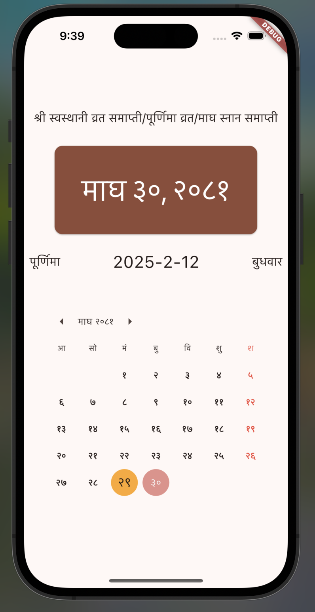

# Patro

HamroPatro has too much ads. We scrape their website, save data (date and tihis)
in JSON and build alternative simpler ad-free mobile app, website and CLI out of
it.

## API

Meta at: <https://sumanchapai.github.io/patro/meta.json>\
Year data available by replacing the word `meta` in the meta api with the year.
For example: <https://sumanchapai.github.io/patro/2080.json>

## Chrome-extension

You can get the Patro chrome extension at the chrome web store
[here](https://chromewebstore.google.com/detail/patro/mnagbabdhfjkajadblahmbbddecinhml).
The extension also supports various keyboard shortcuts for easier navigation
which can be manually set/changed at `chrome://extensions/shortcuts`.

<p align='center'>


</p>

## CLI

Install the CLI by running (with `go >= 1.21` installed)

```bash
go install github.com/sumanchapai/patro/cli/patro@latest
```

Use the CLI as follows

```bash
# Display the current month calendar
patro

# Display the calendar for the previous, current, and next month
patro -3

# Display the calendar for a given year, example patro 2080
patro <year>

# Display the calendar of a specific month of a specific year, example patro 7 2080
# Note that it's not patro <year> <month> to follow the convention of the cal command
patro <month> <year>
```

If you also want the tithis displayed on the calendar, pass the "--tithi" flag
or "-t" as shortcut. For example,

```bash
patro -t
```

displays the patro with tithis alongside date. Note that because an API request
has to be made to get the tithi, the response is a bit slower when using the
tithi flag.


**Patro** is a Flutter-based mobile application that provides an ad-free solution for viewing the current Nepali and English date-time. The app is lightweight, fast, and designed for simplicity.



## Features
- Display current Nepali and English date
- Ad-free experience
- Lightweight and efficient design
- Built using Flutter for cross-platform compatibility

## Installation
### Prerequisites
- Ensure you have Flutter installed. If not, follow the [official installation guide](https://flutter.dev/docs/get-started/install).

### Steps
1. Clone the repository:
   ```sh
   git clone https://github.com/yourusername/patro.git
   ```
2. Navigate to the project directory:
   ```sh
   cd patro
   ```
3. Install dependencies:
   ```sh
   flutter pub get
   ```
4. Run the app:
   ```sh
   flutter run
   ```

## Usage
- Open the app to view the current date-time in both Nepali and English formats.
- The app automatically updates the date and time without any manual refresh.

## Technologies Used
- **Flutter** - Cross-platform framework
- **Dart** - Programming language

## Contributing
Contributions are welcome! To contribute:
1. Fork the repository.
2. Create a feature branch (`git checkout -b feature-name`).
3. Commit your changes (`git commit -m 'Add new feature'`).
4. Push to the branch (`git push origin feature-name`).
5. Open a pull request.

## License
This project is licensed under the MIT License.

## Contact
For any inquiries, feel free to open an issue on GitHub.

---

Enjoy using **Patro** for a clean and distraction-free date-time experience!
