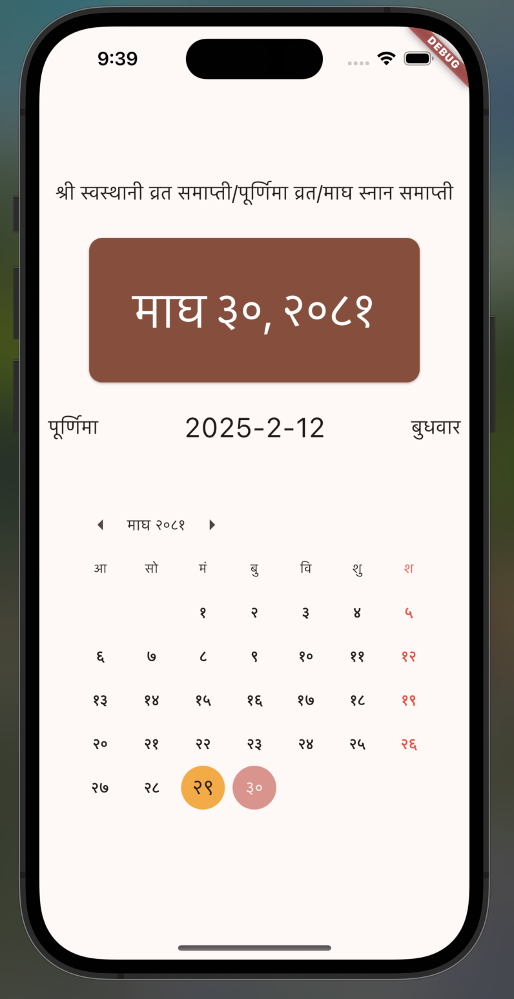

# Patro (Archived)

> [!WARNING]
> **This project is archived and is no longer maintained.**
>
> This repository was originally created to provide a simple, ad-free alternative
> to HamroPatro by scraping and republishing calendar data. While it served its
> purpose well, it is no longer the recommended source for Nepali calendar data.
>
> **Please use the Miti Calendar by Yarsa Himalaya instead.**
>
> The [Miti Calendar](https://miti.yarsahimalaya.com/) team manually verifies the Nepali calendar (tithi, dates, and
> Panchanga data) every year before publishing. Unlike this archived project,
> their calendar is actively maintained and validated against reliable
> Panchanga/Patro sources.
>
> They also publicly publish their calendar source files each year, making it a
> much better foundation if you want to build your own Nepali calendar app,
> website, API, CLI, or any other project on top of accurate calendar data.
>
> This repository remains available for historical reference only.

---

## Why this project is archived

When this project started, there were very few simple and ad-free ways to access
Nepali calendar data programmatically. Scraping an existing calendar website was
the quickest way to make the data available for a mobile app, website, browser
extension, and CLI.

Today, there is a better alternative.

Rather than maintaining another scraper that depends on a third-party website,
I recommend using the calendar data published by **Miti Calendar (Yarsa
Himalaya)**. Their data is actively maintained, manually verified every year,
and published in an open format that developers can build upon.

For these reasons, this repository has been archived.

---

HamroPatro has too many ads. We scraped their website, saved the date and tithi
information as JSON, and built a simpler ad-free mobile app, website, browser
extension, and CLI on top of it.

## API

Meta at: <https://sumanchapai.github.io/patro/meta.json>\
Year data available by replacing the word `meta` in the meta API with the year.
For example:

<https://sumanchapai.github.io/patro/2080.json>

## Chrome Extension

You can get the Patro Chrome extension at the Chrome Web Store
[here](https://chromewebstore.google.com/detail/patro/mnagbabdhfjkajadblahmbbddecinhml).

The extension also supports various keyboard shortcuts for easier navigation,
which can be manually set or changed at `chrome://extensions/shortcuts`.

<p align='center'>


</p>

## CLI

Install the CLI by running (with `go >= 1.21` installed)

```bash
go install github.com/sumanchapai/patro/cli/patro@latest
```

Use the CLI as follows

```bash
# Display the current month calendar
patro

# Display the calendar for the previous, current, and next month
patro -3

# Display the calendar for a given year
patro <year>

# Display the calendar of a specific month of a specific year
# Note that it's not patro <year> <month> to follow the convention of the cal command
patro <month> <year>
```

If you also want the tithis displayed on the calendar, pass the `--tithi` flag
(or `-t`).

```bash
patro -t
```

This displays the calendar with tithis alongside each date. Because an API
request is required to fetch the tithi data, responses may be slightly slower
when using this flag.

## Flutter

**Patro** also includes a Flutter-based mobile application that provides an
ad-free view of the current Nepali and English calendar.



### Prerequisites

- Flutter

### Steps

1. Clone the repository

```sh
git clone git@github.com:sumanchapai/patro.git
```

2. Navigate to the project

```sh
cd patro/flutter
```

3. Install dependencies

```sh
flutter pub get
```

4. Run the app

```sh
flutter run
```

## License

MIT
